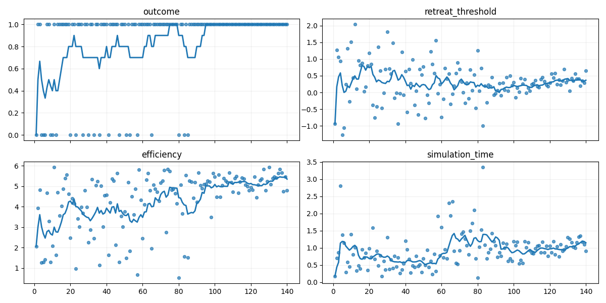

<p align="center">
  
</p>

<h1 align="center">Leitwerk</h1>
<p align="center">
  <em>Tune your magic numbers with stochastic optimization.</em>
</p>

`leitwerk` is a schema-based evolutionary optimizer for long-running training loops. It comes with:

- parameters as plain dataclasses in your code
- JSON checkpoints you can inspect and resume
- schema reconciliation, so you can keep developing and retain progress

## Links

- [Documentation](https://phantomsc2.github.io/leitwerk/)
- [Integration Guide](https://phantomsc2.github.io/leitwerk/guide/)
- [API Reference](https://phantomsc2.github.io/leitwerk/reference/api/)

## Installation

Requires: Python >=3.11,<3.14

```sh
pip install .
```

For a development setup with tests, docs, benchmarks and `python-sc2`:

```sh
pip install -e .[dev,docs,benchmark]
```

For the StarCraft II example, the game itself or Docker is required additionally.

## Example - Function Minimization

The core API of `leitwerk` is an ask/tell black-box optimizer:

```py
from dataclasses import dataclass
from typing import Annotated

from leitwerk import Optimizer, OptimizerSettings, Parameter

@dataclass
class Params:
    a: Annotated[float, Parameter()]
    b: Annotated[float, Parameter()]

opt = Optimizer(Params)
for _ in range(1000):
    x = opt.ask()
    fx = -(x.a - 1) ** 2 - (x.b - 2) ** 2
    opt.tell(fx)
```

```pycon
>>> opt.mean
Params(a=1.00000000015942, b=2.000000000284411)
```

## Example - StarCraft II Bot

For a real training loop with file persistence, see: [examples/train_sc2_bot.py](examples/train_sc2_bot.py)

What it does:

- set up a simple worker rush bot with parameters `simulation_time` and `retreat_threshold`
- run games continually against the built-in AI
- score each game using win/loss and a combat heuristic
- persist state with `OptimizerSession` and plot results

Run it directly if you want to observe the games:

```sh
python examples/train_sc2_bot.py
```

Alternatively, the headless docker setup runs a bit faster:

```sh
cd examples
docker compose up --build
```

On the first run, this will download a 3.8GB installation of SC2 for Linux, so it can take a few while.

### Training Results

The example saves progress in `examples/data` after each game:

- `params.json`: optimizer state
- `plot.png`: graphs showing parameter samples and result values and over time
- `history.json`: helper file

<p align="center">
  
</p>

Initially, it explores samples from a wide range with a winrate of about 50-80%.
After about 100 games, the optimizer settles on stable values with perfect winrate.

## Developer Commands

- `make fix`: auto-format
- `make check`: lint and test
- `make docs`: build docs
- `make docs-serve`: serve docs locally
